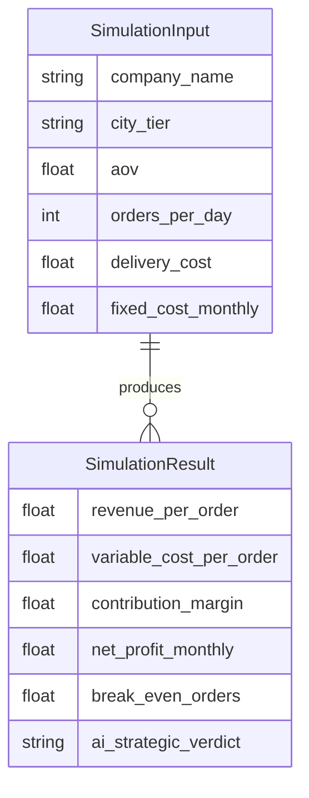

# ProfitEngine.AI

**Boardroom-Ready Strategic Simulator for the Quick Commerce Sector.**

ProfitEngine.AI is an advanced decision support system to analyze the Unit Economics of Quick Commerce giants (Blinkit, Zepto, Instamart). It combines financial modeling, AI/heuristic strategy, dynamic market visualization, and professional reporting.

---

## `economics.py`: Unit Economics Calculation Engine

This file defines the core function responsible for calculating all essential financial metrics for a Quick Commerce player, given their operational parameters.

### Core Function

```python
def calculate_metrics(data):
    # 1. Revenue Dynamics
    platform_revenue_per_order = data.aov * data.commission_rate

    # 2. Variable Costs (Per Order)
    variable_cost = data.delivery_cost + (data.aov * (data.discount_rate / 100))

    # 3. Contribution Margin (CM)
    contribution_margin = platform_revenue_per_order - variable_cost

    # 4. Total Monthly Math
    monthly_volume = data.orders_per_day * 30
    gross_contribution = contribution_margin * monthly_volume
    net_profit_monthly = gross_contribution - data.fixed_cost_monthly

    # 5. Break Even Point (BEP)
    if contribution_margin > 0:
        break_even_orders_monthly = data.fixed_cost_monthly / contribution_margin
    else:
        break_even_orders_monthly = -1  # Indicates Impossible/Infinite

    return {
        "revenue_per_order": round(platform_revenue_per_order, 2),
        "variable_cost_per_order": round(variable_cost, 2),
        "contribution_margin": round(contribution_margin, 2),
        "net_profit_monthly": round(net_profit_monthly, 2),
        "break_even_orders": round(break_even_orders_monthly, 0)
    }
```

#### What it does

- **Calculates**:
  - Revenue per order (platform commission × AOV)
  - Variable cost per order (delivery + discounts)
  - Contribution margin (core profitability per order)
  - Monthly net profit (after fixed costs)
  - Break-even orders per month (with a safe fallback for negative margins)

#### Notes

- Returns a dictionary of rounded key metrics for use in simulations, reporting, and AI analysis.
- Uses a sentinel value (`-1`) for impossible break-even points (e.g., if margins are negative).

---

## `ai_engine.py`: Strategic AI & Heuristic Verdict Engine

This module generates strategic insights for a company using either OpenAI's GPT (if available) or a robust fallback logic.

### Core Function

```python
def generate_strategic_insight(metrics, company, city):
    """
    Generates a strategic verdict using OpenAI (Real AI) or falls back to logic (Hardcoded).
    """
    
    # 1. SETUP: Prepare the data for the prompt
    cm = metrics["contribution_margin"]
    profit = metrics["net_profit_monthly"]
    be_orders = metrics["break_even_orders"]
    
    api_key = os.getenv("OPENAI_API_KEY")

    # 2. REAL AI MODE: If Key exists, ask GPT
    if HAS_OPENAI and api_key:
        try:
            client = OpenAI(api_key=api_key)
            
            # The Prompt: We give the AI the persona of a Senior Strategy Consultant
            prompt = (
                f"Act as a Senior Strategy Consultant for a Quick Commerce company. "
                f"Analyze these financials for {company} operating in a {city} environment:\n"
                f"- Contribution Margin per Order: ₹{cm}\n"
                f"- Monthly Net Profit: ₹{profit}\n"
                f"- Break-Even Orders Needed: {be_orders}\n\n"
                f"Task 1: Give a 3-word strategic verdict (e.g., 'Aggressive Growth Viable').\n"
                f"Task 2: Provide a 2-sentence strategic recommendation using the VRIO framework. "
                f"Focus on whether they should burn cash to grow or cut costs to survive."
            )

            response = client.chat.completions.create(
                model="gpt-3.5-turbo", # Use "gpt-4" if you have access and budget
                messages=[
                    {"role": "system", "content": "You are an expert in Unit Economics and Business Strategy."},
                    {"role": "user", "content": prompt}
                ],
                max_tokens=150,
                temperature=0.7
            )

            # Parse the response
            content = response.choices[0].message.content
            
            # Simple parsing logic (assuming GPT follows instructions)
            # We split by newlines or just return the whole blob
            lines = content.split('\n')
            verdict = lines[0].replace("Task 1:", "").strip()
            recommendation = content.replace(lines[0], "").replace("Task 2:", "").strip()

            return verdict, recommendation

        except Exception as e:
            print(f"OpenAI API Error: {e}")
            # Fall through to the backup logic below
            pass

    return verdict, recommendation
```

#### What it does

- **Logic**: OpenAI is configured, prompts GPT for a verdict and recommendation.

#### Key Highlights

- Incorporates VRIO framework (Value, Rarity, Imitability, Organization) in recommendations for strategic rigor.

---

## `models.py`: Pydantic Data Model Definitions

Defines the **input** and **output** schemas for simulation, ensuring type safety and validation in the FastAPI backend.

### Models

```python
from pydantic import BaseModel

class SimulationInput(BaseModel):
    company_name: str
    city_tier: str
    aov: float
    orders_per_day: int
    delivery_cost: float
    commission_rate: float
    discount_rate: float
    fixed_cost_monthly: float

class SimulationResult(BaseModel):
    revenue_per_order: float
    variable_cost_per_order: float
    contribution_margin: float
    net_profit_monthly: float
    break_even_orders: float
    strategic_verdict: str
    ai_recommendation: str
```

#### What it does

- **SimulationInput**: Describes all the levers a user can adjust (AOV, orders, costs, etc).
- **SimulationResult**: Returns all calculated metrics plus AI verdict and recommendation in API responses.

---

## `main.py`: FastAPI Server & API Endpoints

Acts as the API layer for all simulator operations, including simulation, caching, and market data retrieval.

### Key Features

- **CORS-enabled** for frontend-backend communication.
- **Market cache** for storing latest simulation data by company.
- **Endpoints** for simulation, saving, and market data.

### API Endpoints

#### Root Status Endpoint

##### `GET /`

Returns server status.

```api
{
    "title": "Root Status Check",
    "description": "Returns the current status of the server.",
    "method": "GET",
    "baseUrl": "https://quick-commerce-backend-livid.vercel.app",
    "endpoint": "/",
    "headers": [],
    "queryParams": [],
    "pathParams": [],
    "bodyType": "none",
    "requestBody": "",
    "responses": {
        "200": {
            "description": "Server is active",
            "body": "{ \"status\": \"active\" }"
        }
    }
}
```

#### Simulate Strategy Endpoint

##### `POST /simulate`

Calculates metrics and generates a strategic recommendation.

```api
{
    "title": "Simulate Strategy",
    "description": "Runs a simulation using provided input and returns all metrics plus AI strategic recommendation.",
    "method": "POST",
    "baseUrl": "https://quick-commerce-backend-livid.vercel.app",
    "endpoint": "/simulate",
    "headers": [
        {
            "key": "Content-Type",
            "value": "application/json",
            "required": true
        }
    ],
    "queryParams": [],
    "pathParams": [],
    "bodyType": "json",
    "requestBody": "{\n  \"company_name\": \"Blinkit\",\n  \"city_tier\": \"Tier 1 (Delhi)\",\n  \"aov\": 450,\n  \"orders_per_day\": 3000,\n  \"delivery_cost\": 55,\n  \"commission_rate\": 0.15,\n  \"discount_rate\": 5.0,\n  \"fixed_cost_monthly\": 200000\n}",
    "responses": {
        "200": {
            "description": "Simulation results with strategic verdict",
            "body": "{\n  \"revenue_per_order\": 67.5,\n  \"variable_cost_per_order\": 77.5,\n  \"contribution_margin\": -10,\n  \"net_profit_monthly\": -500000,\n  \"break_even_orders\": -1,\n  \"strategic_verdict\": \"CRITICAL: Negative Unit Economics\",\n  \"ai_recommendation\": \"Strategy: Survival Mode. ...\"\n}"
        }
    }
}
```

#### Save Scenario Endpoint

##### `POST /save-scenario`

Persists the simulation result for a given company.

```api
{
    "title": "Save Market Scenario",
    "description": "Saves the current scenario result to the market cache.",
    "method": "POST",
    "baseUrl": "https://quick-commerce-backend-livid.vercel.app",
    "endpoint": "/save-scenario",
    "headers": [
        {
            "key": "Content-Type",
            "value": "application/json",
            "required": true
        }
    ],
    "queryParams": [],
    "pathParams": [],
    "bodyType": "json",
    "requestBody": "{\n  \"company_name\": \"Blinkit\",\n  \"data\": { /* SimulationResult object */ }\n}",
    "responses": {
        "200": {
            "description": "Current cache state after save",
            "body": "{ \"status\": \"saved\", \"current_cache\": { ... } }"
        }
    }
}
```

#### Get Market Data Endpoint

##### `GET /market-data`

Retrieves the current market cache for frontend analysis.

```api
{
    "title": "Get Market Data",
    "description": "Returns the current state of the market cache.",
    "method": "GET",
    "baseUrl": "https://quick-commerce-backend-livid.vercel.app",
    "endpoint": "/market-data",
    "headers": [],
    "queryParams": [],
    "pathParams": [],
    "bodyType": "none",
    "requestBody": "",
    "responses": {
        "200": {
            "description": "Returns market cache",
            "body": "{ \"Blinkit\": { ... }, \"Zepto\": { ... }, \"Instamart\": { ... } }"
        }
    }
}
```
---

## `App.jsx`: Main React Application Shell

This is the root React component, defining the overall layout, sidebar navigation, and routing.

### Responsibilities

- **Sidebar navigation**: Quick access to Simulator, Market Analysis, and Strategic Reports.
- **Routing**: Uses `react-router-dom` to display the appropriate screen.
- **UI Consistency**: Applies unified styles and branding.

### Key Elements

- Sidebar with icons and links (using Lucide for visuals).
- Main content area renders the selected page.
- Persistent layout throughout navigation.

---

## `Simulator.jsx`: Interactive Profitability Simulator

This is the **core user interaction** page, allowing scenario building and instant simulation.

### Core Features

- **Dynamic input levers**: Sliders and selectors for company, AOV, order volume, costs, etc.
- **Sticky state**: Input state is saved in browser localStorage for persistence across reloads.
- **Auto-simulation**: Runs the simulation via API on every input change (debounced).
- **Save/Update Scenario**: Commits the current result to both history and market data cache.
- **History display**: Shows previously saved scenarios and their key outputs.
- **Visualizations**: Bar charts for financial breakdown using Chart.js.
- **Strategic verdict**: Prominently displays the AI/heuristic recommendation.

---

## `MarketAnalysis.jsx`: Live Market & Competitor Dashboard

Provides a **dynamic, comparative analysis** of all major entities in the simulation.

### Core Features

- **Live data sync**: Pulls latest scenarios from Simulator (via localStorage).
- **Market share pie chart**: Projects revenue share by company.
- **Radar chart**: Visualizes strategic capabilities (speed, variety, tech, loyalty, price).
- **KPI grid**: Cards showing net profit and status for each player.
- **Battle card table**: Side-by-side comparison of important metrics and strategic verdicts.

### Data Flow

- Reads from localStorage (`scenarioCache`).
- Fallbacks to default scenarios if none exist.
- Renders with Chart.js and Lucide icons for clarity.

---

## `StrategicReports.jsx`: Boardroom-Ready PDF Generator

This page allows users to **generate professional PDF documents** from their latest simulations.

### Core Features

- **PDF types**: Executive Brief, Financial Audit, Investor Pitch.
- **jsPDF & autoTable**: Rich, vector-quality charts and tables rendered in documents.
- **Charts in PDF**: Custom-drawn profitability and revenue charts.
- **Scenario readiness**: Checks simulation data availability before allowing downloads.

### Report Types

| Report Type        | Focus                                               | Visuals Included                         |
|--------------------|-----------------------------------------------------|------------------------------------------|
| Executive Brief    | Operational strategy, profitability landscape       | Diverging bar, performance matrix        |
| Financial Audit    | Cost structure, break-even analysis                 | Detailed table, variable/fixed costs     |
| Investor Pitch     | Growth, GMV, investment rating                      | GMV chart, asset ratings, moat analysis  |

---

## Database & Model Relationships



---

## Key Takeaways

```card
{
    "title": "Resilient Decision Engine",
    "content": "ProfitEngine.AI is robust against backend outages or AI API errors, always delivering actionable business insight."
}
```

```card
{
    "title": "Persistent, Local-First Architecture",
    "content": "All simulation and market analysis data is stored in browser cache, ensuring continuity and fast reloads."
}
```

---

## Best Practices & Recommendations

- **Always use the Simulator** to update company scenarios before generating reports.
- **Review the Market Analysis** dashboard to identify gaps and strategic opportunities.
- **Export PDF reports** for sharing with stakeholders or presentations.

---

## License

ProfitEngine.AI is open-source and available under the MIT License.

---

**Generated by ProfitEngine.AI**
